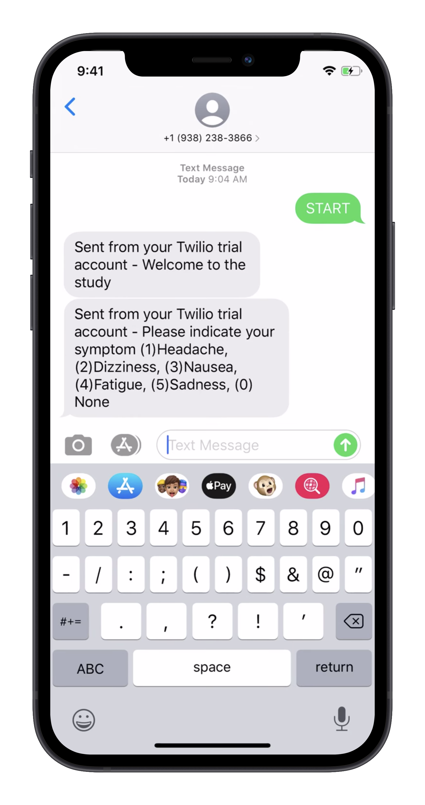

# Twilio API

An express.js application that allows sending of SMS messages to the user and to create a conversation with the user. The app is based on the Twilio API (https://www.twilio.com (Links to an external site.)).

[Click here](https://www.youtube.com/watch?v=iuR0kd2L2BM) to watch the demonstration of the application.

